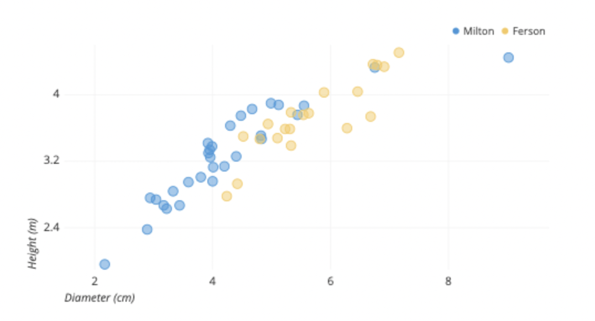

# EDA and Data Preprocessing

## 1. EDA(Exploratory DATA Analysis)

### 개요

* EDA란?

  데이터 분석에 있어서 초기 분석의 단계이며, 데이터 분석 전체 프로세스 중에 7 ~ 80% 시간을 소모할 만큼 중요한 부분입니다.

* 내용

  * 패턴발견 : 시각화 도구 사용
  * 데이터 특성 발견
  * 가설 검정 : 통계, 그래픽, 시각적 표현 등을 사용

* 종류

  * Graphic : 그림,차트,시각적 요소를 통해 데이터를 확인
  * Non-Graphic : Summary Statistics를 통해 데이터를 확인

* Target

  * Univariate
  * Multi-Variate : 여러 변수들간의 관계를 보는 것이 주요 목적

### 구분

EDA의 종류와 Target을 조합하여 아래와 같이 구분합니다.

* Uni-Graphic

  Histogram, Pie chart, Stem-leaf plot, Boxplot, QQplot, Binning, Tabulation 등을 사용합니다.

  * Histogram : 순서형 자료와 수치형 자료를 도수분포표를 이용해서 그래프 형태로 나타낸 것

  * Pie chart : 파이형태로 명목자료를 그래프로 표시하는 방법으로, 각 계급의 비율을 중심으로 볼 때 많이 사용

  * Stem-leaf plot : 
    * Histogram을 옆으로 돌려 높은 것과 같은 숫자형 자료에 사용
    * Histogram과 달리 정보손실이 없음, 각 자료의 값을 알 수 있어 추가 정보를 더 얻을 수 있음
    * 줄기(Stem)과 잎(Leaf)로 구성
      * 한 줄기에 0에서 9까지의 잎이 가능
    
  * Boxplot : 막대그림의 명목자료를 그래프로 표시하는 방법으로, 순위를 정할 때 많이 사용

  * QQplot : 데이터의 분포와 이론상 분포가 잘 이치하는지 확인

    

    
출처 : https://en.wikipedia.org/wiki/Q%E2%80%93Q_plot)

  * Bining : Data를 bining한다 라고 부르기도 하는데, 이는 정의된 기준에 따라 각각의 개별적인 데이터값을 특정한 bin(구간, interval) 또는 group으로 묶는 과정을 의미

  * Tabulation : 범주형 변수일 경우 교차분석(Cross tabulations)을 사용

* Multi-Graphic

  Category & Numeric : Boxplots, Stacked bar, Parallel Coordinate, Heatmap

  * Boxplots : 

    * 많은 데이터를 눈으로 확인하기 어려울 때 그림을 이용해 데이터 집합의 범위와 중앙값을 빠르게 확인할 수 있는 목적으로 사용

    * 통계적으로 이상치(Outlier) 있는지도 확인

      

      
(출처 : https://leebaro.tistory.com/entry/%EB%B0%95%EC%8A%A4-%ED%94%8C%EB%A1%AFbox-plot-%EC%84%A4%EB%AA%85)

  * Stacked bar : 막대차트의 응용으로 Bar가 누적된 형태의 차트

    

    
(출처 : https://jessymin.github.io/python/2019/02/10/stacked_bar_chart_python.html)

  * Parallel Coordinate : 데이터의 각 행을 변수별로 선으로 매핑시켜 나타내는 방식

    

    
(출처 : file:///Users/jsshin/Downloads/Dialnet-AnalisisDeDatosMultivariantesConCoordenadasParalel-5897852.pdf)

  * Heatmap : 데이터의 값을 컬러로 변환시켜 열 분포 형태로 보여주어 시각적인 분석을 가능하게 하는 데이터 시각화 기법

    

    
(출처 : https://rfriend.tistory.com/419)

  Continuous & Numeric : Sactter Plot

  * Scatter Plot : 산점도란 변수 x와 변수 y의 관계를 좌표 위에 표시하여 시각화한 그래프

    

    
(출처 : https://chartio.com/learn/charts/what-is-a-scatter-plot/)

* Multi-Non Graphic

  * 데이터들의 관꼐를 보는 것이 주된 목표

  * 종류 : Cross-Tabulation, Cross-Statistic(Correlation, Covariance)

    * Numerical Feature의 경우 Cross statisticsc처럼 색상을 넣어 히트맵처럼 시각화 가능

      

      
 (출처 : https://camo.githubusercontent.com/)

      

      

## 2. Pandas를 이용한 기초 EDA

* Missing Data
  * isna, isnull, notna, notnull, dropna, fillna

* Data Frame

  * index, columns, dtypes, info, select_dtypes, loc, iloc, insert, head, tail, apply, aggregate

    , drop, rename, replace, nsmallest, nlargest, sort_values, sort_index, value_counts,

    describe, shape

* Visualization
  * plot, plot.area, plot.bar, plot.barh, plot.box, plot.density, plot.hexbin, plot.hist, plot.kde , plot.line, plot.pie, plot.scatter

## 3. Data Preprocessing

* 데이터 분석의 목적에 맞게 데이터를 가공하는 작업의 전 과정을 데이터의 전처리(Data Preprocessing)이라고 합니다.

  

* 아무리 좋은 모델이어도 모델에 입력되는 데이터의 질이 좋지 않다면 결과 또한 좋지 않습니다(GIGO : Garbage In Garbage Out)

### FLOW

Data cleaning, Data integration, Data. transformation, Data reduction

* Data cleaning

  노이즈를 제거하거나 비일정성을 보정하는 과정을 의미합니다.

  * Missing Values
    * Ignore the tuple
    * Manual Fil
    * Global Constant
    * Imputation
  * Noisy Data
  * Binning
  * Regression
  * Outlier analysis

* Integration

  * 여러개로 나누어져 있는 데이터들을 분석하기 편하게 하나로 합치는 과정을 의미합니다.
  * Merge사용

* Transformation

  * 데이터의 형태를 변환하는 작업으로, 스케일링(scaling) 이라고 부르기도 합니다.
  * Normalize사용

* Reduction

  * 데이터를 의미있게 줄이는 것을 의미하며, dimension reduction과 유사한 목적을 가집니다.
  * 차원의 저주관련, pca사용

